# Flowchart — GL Reporting Talenta SAP

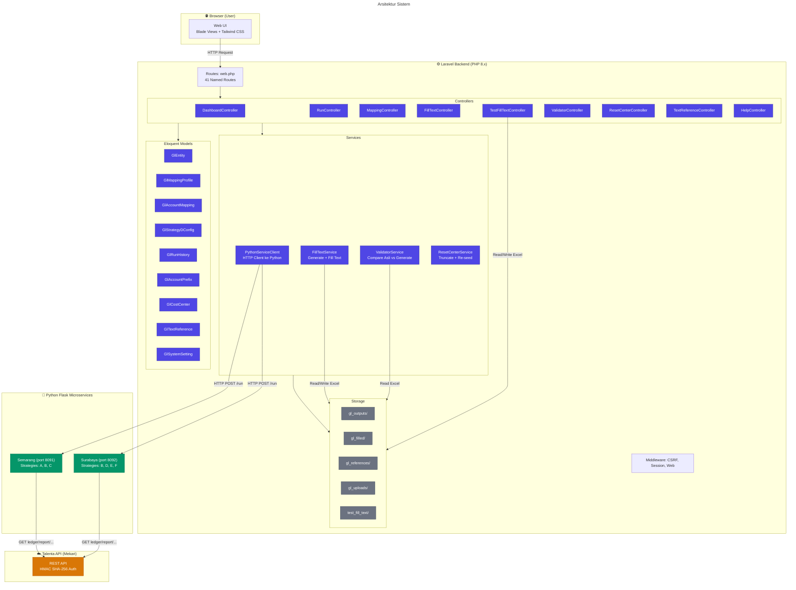

---

## 1. Run Extraction — Alur Utama

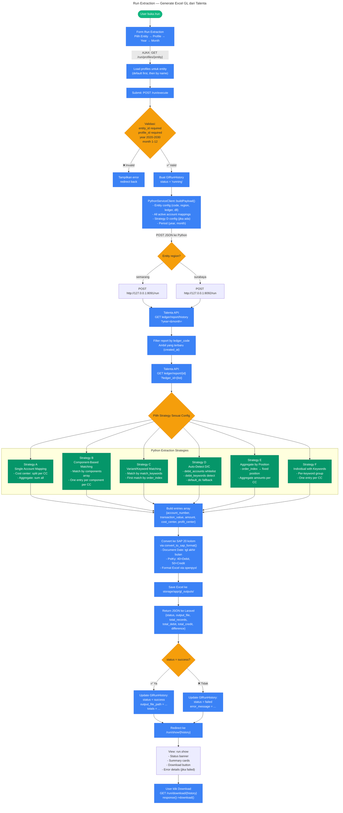

---

## 2. Mapping Editor — CRUD Profile & Mapping

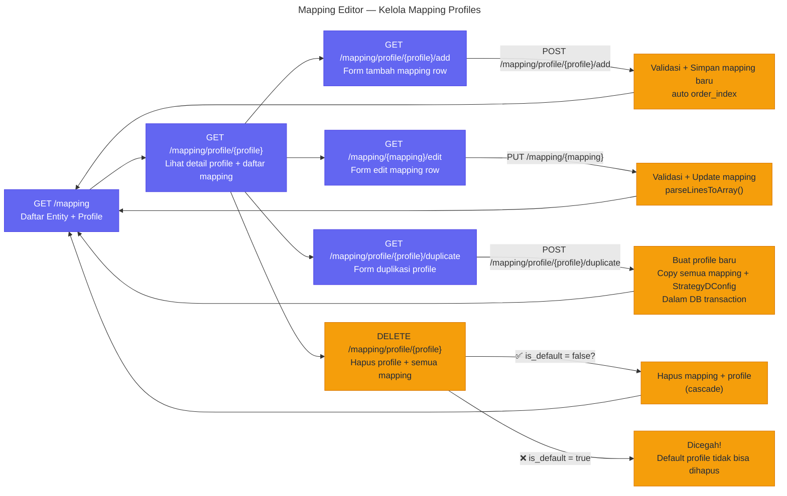

---

## 3. Fill Text — Generate Label dari Knowledge Base

```mermaid
---
title: Fill Text — Isi Kolom Text Otomatis
---
flowchart TD
    Start(["User buka /fill-text"]) --> Form["Form Fill Text<br/>- 50 recent successful runs<br/>- Pilih history_id<br/>- Optional: upload reference file"]

    Form --> Submit["POST /fill-text/run"]

    Submit --> ValidateFT{"Validasi:<br/>history_id exist<br/>output_file ada?"}

    ValidateFT -->|❌ Invalid| ErrBack["redirect back with error"]
    ValidateFT -->|✅ Valid| CheckRef{"Ada reference file<br/>diupload?"}

    CheckRef -->|"Ya"| ParseRef["FillTextService::parseReferenceFile()<br/>- Baca Excel<br/>- Auto-learn setiap reference<br/>- Skip problem texts"]
    CheckRef -->|"Tidak"| LoadFill

    ParseRef --> LoadFill["FillTextService::fill()"]

    LoadFill --> BuildMaps["Build lookup maps:<br/>- referenceMap → GlTextReference<br/>- prefixMap → GlAccountPrefix<br/>- ccMap → GlCostCenter<br/>- ccNameMap → GlCostCenter"]

    BuildMaps --> LoopRows["Loop setiap row di Excel Generate"]

    LoopRows --> GenText["generateText(account, cc, maps)"]

    GenText --> Priority{"Priority Chain:"}

    Priority -->|"1. Ada reference<br/>di GlTextReference?"| RefCheck{"isProblemText?"}
    RefCheck -->|"✅ Valid"| UseRef["return reference text<br/>source: 'reference'"]
    RefCheck -->|"❌ Legacy format"| UseLegacy["return text as-is<br/>source: 'legacy'"]
    RefCheck -->|"❌ No prefix marker"| UseNoPrefix

    Priority -->|"2. No reference"| CheckPrefix{"Ada prefix<br/>di GlAccountPrefix?"}
    CheckPrefix -->|"❌ Tidak"| UseNoPrefix["return '?? Account-Belum-Prefix'<br/>source: 'no_prefix'"]
    CheckPrefix -->|"✅ Ya"| CheckCC{"Cost Center<br/>di row kosong?"}

    CheckCC -->|"✅ Kosong"| UsePrefixOnly["return prefix saja<br/>source: 'prefix_only'<br/>Contoh: 'Uang Titipan'"]
    CheckCC -->|"❌ Ada isi"| FindCCDesc{"Cari ccDescription<br/>di GlCostCenter"}

    FindCCDesc -->|"✅ Ditemukan"| UseFull["return prefix + ' - ' + ccDesc<br/>source: 'prefix_with_cc'<br/>Contoh: 'Gaji - KARYAWAN TETAP'"]
    FindCCDesc -->|"❌ Tidak"| UseNeedFill["return prefix + ' (NEED FILL)'<br/>source: 'no_cc_desc'"]

    UseRef & UseLegacy & UseNoPrefix & UsePrefixOnly & UseFull & UseNeedFill --> WriteCell["setCellValue(TextCol, text)"]

    WriteCell --> LoopEnd{"Row terakhir?"}
    LoopEnd -->|"Belum"| LoopRows
    LoopEnd -->|"Ya"| SaveFilled["Save Excel ke gl_filled/<br/>Auto-learn text baru<br/>ke GlTextReference"]

    SaveFilled --> ResultView["Redirect ke<br/>/fill-text/result-view/{history}"]

    subgraph ManualFix["Manual Fix Flow"]
        ResultView --> ScanProblems["scanProblemRows()<br/>Cari problem rows:<br/>- no_prefix<br/>- no_cc_desc<br/>- legacy"]
        ScanProblems --> ShowResult["View: fill_text.result<br/>- Stats cards<br/>- Problem rows table<br/>- Input prefix + cc description"]
        ShowResult -->|"User isi manual"| SaveManual["POST /fill-text/{history}/save-manual"]
        SaveManual --> SaveData["FillTextService::saveManualTextsAndRegenerate()"]
        SaveData --> DBUpdates["1. Save/update → gl_account_prefixes<br/>2. Save/update → gl_cost_centers<br/>3. Save → gl_text_references"]
        DBUpdates --> ExcelUpdate["4. Update Excel dengan text baru"]
        ExcelUpdate --> ShowPage["Redirect ke /fill-text/show/{history}"]
    end

    ResultView --> Download["User download<br/>GET /fill-text/download/{history}<br/>response()->download()<br/>+ cache-busting headers"]

    classDef process fill:#3b82f6,color:#fff,stroke:#2563eb
    classDef decision fill:#f59e0b,color:#1e293b,stroke:#d97706
    classDef endpoint fill:#10b981,color:#fff,stroke:#059669
    class Start,Download,ErrBack endpoint
    class Form,Submit,ParseRef,LoadFill,BuildMaps,LoopRows,GenText,WriteCell,LoopEnd,SaveFilled,ResultView,ScanProblems,ShowResult,SaveManual,SaveData,DBUpdates,ExcelUpdate,ShowPage process
    class ValidateFT,CheckRef,Priority,RefCheck,CheckPrefix,CheckCC,FindCCDesc decision
```

---

## 4. Subtype Fill Text — Khusus Account 2010000005 (Uang Titipan)

```mermaid
---
title: Subtype Fill Text — Position-Based Matching
---
flowchart TD
    Start(["User buka /fill-text/subtype"]) --> Form["Form Upload 2 File<br/>1. Ledger Mapping Export<br/>2. Target File (Excel GL)"]

    Form --> Submit["POST /fill-text/subtype/process"]

    Submit --> ValidateUpload{"Validasi:<br/>ledger_file.xlsx<br/>target_file.xlsx<br/>max 10MB"}

    ValidateUpload -->|❌ Invalid| ErrBack["redirect back with error"]
    ValidateUpload -->|✅ Valid| StoreFiles["StoreUpload()<br/>Simpan ke storage/app/test_fill_text/"]

    StoreFiles --> ParseLedger["getLedgerRowsForAccount('2010000005')<br/>- Baca ledger file<br/>- Filter GL Entry = 2010000005<br/>- Return: [GL Entry, Description,<br/>  Component ID, Component Name]<br/>- PRESERVE empty entries"]

    ParseLedger --> ParseTarget["getTargetRowsForAccount('2010000005')<br/>- Baca target file<br/>- Filter Account = 2010000005<br/>- Return: [excel_row, amount,<br/>  cost_center, text]"]

    ParseTarget --> CompareCount{"count(ledger) ===<br/>count(target)?"}

    CompareCount -->|"❌ Tidak"| FlashWarning["⚠️ Flash warning:<br/>Perbedaan jumlah entry"]
    CompareCount -->|"✅ Ya"| MatchPositional

    FlashWarning --> MatchPositional["Positional Matching<br/>target[i] → ledger[i]"]

    MatchPositional --> BuildMatched["Build $matched array<br/>untuk setiap posisi:"]

    BuildMatched --> CheckComp{"component_name<br/>ada isi?"}

    CheckComp -->|"✅ Ya"| LabelMap{"Ada di<br/>LABEL_MAP?"}
    LabelMap -->|"✅ Ya"| UseMap["default_label =<br/>LABEL_MAP[component]"]
    LabelMap -->|"❌ Tidak"| UseFallback["default_label =<br/>'Uang Titipan - ' + component"]
    CheckComp -->|"❌ Kosong"| UseEmpty["default_label = ''"]

    UseMap & UseFallback & UseEmpty --> Session["Store session:<br/>- test_fill_ledger_rows<br/>- test_fill_matched<br/>- test_fill_target_orig_path"]

    Session --> Redirect["Redirect ke<br/>GET /fill-text/subtype/result"]

    Redirect --> View["View: fill_text.subtype_result"]

    View --> Stats["Stats Cards:<br/>- Target Rows<br/>- Ledger Matched<br/>- Unmatched"]

    Stats --> TableCompare["📊 Tabel Komparasi<br/>Side-by-side per posisi:<br/>📄 Ledger (kiri) ↔ 🎯 Target (kanan)<br/>Indikator: ✅ ⚠️ ➕<br/>Color coding: red/amber/orange"]

    TableCompare --> TableEdit["📝 Tabel Mapping Rows<br/>- Komponen Text (read-only)<br/>- Label Output (editable input)"]

    TableEdit --> Apply["User klik 'Apply & Download'<br/>POST /fill-text/subtype/apply"]

    Apply --> ValidateLabels{"Validasi labels:<br/>required|array<br/>nullable|string|max:200"}

    ValidateLabels -->|❌ Invalid| RedirectForm["redirect ke form<br/>with errors"]
    ValidateLabels -->|✅ Valid| CheckSession{"Session valid?<br/>matched + target_path ada?"}

    CheckSession -->|❌ Expired| RedirectUpload["redirect ke form<br/>'Session expired'"]
    CheckSession -->|✅ Valid| CopyFile["Copy target file → temp"]

    CopyFile --> FindTextCol["findColumnByHeader(sheet, 'text')<br/>Cari kolom Text di Excel"]

    FindTextCol --> TextFound{"Kolom Text<br/>ditemukan?"}

    TextFound -->|"❌ Tidak"| Cleanup["Hapus temp file<br/>redirect ke form<br/>with error"]
    TextFound -->|"✅ Ya"| WriteLabels["Loop matched rows:<br/>setCellValue(TextCol.row, label)"]

    WriteLabels --> SaveTemp["Save Excel → temp file"]

    SaveTemp --> ClearSession["Session forget:<br/>test_fill_matched<br/>test_fill_target_orig_path"]

    ClearSession --> Download["response()->download(tempFile)<br/>deleteFileAfterSend(true)<br/>→ Test_Filled_*.xlsx"]

    classDef process fill:#3b82f6,color:#fff,stroke:#2563eb
    classDef decision fill:#f59e0b,color:#1e293b,stroke:#d97706
    classDef endpoint fill:#10b981,color:#fff,stroke:#059669
    classDef view fill:#8b5cf6,color:#fff,stroke:#7c3aed
    class Start,Download,ErrBack,RedirectForm,RedirectUpload endpoint
    class Form,Submit,StoreFiles,ParseLedger,ParseTarget,FlashWarning,MatchPositional,BuildMatched,Session,Redirect,Stats,TableCompare,TableEdit,Apply,CopyFile,FindTextCol,Cleanup,WriteLabels,SaveTemp,ClearSession process
    class ValidateUpload,CompareCount,CheckComp,LabelMap,ValidateLabels,CheckSession,TextFound decision
    class View,Form,Apply view
```

---

## 5. Validator — Komparasi File Asli vs Generate

```mermaid
---
title: Validator — Verifikasi Keakuratan GL
---
flowchart LR
    Start(["User buka /validator"]) --> Form["Form Validator<br/>- Pilih history run<br/>- Upload file Asli dari Talenta"]

    Form --> Submit["POST /validator/run"]

    Submit --> ValidateVal{"Validasi:<br/>history_id exist<br/>asli_file xlsx/xls"}

    ValidateVal -->|❌ Invalid| ErrBack["redirect back"]
    ValidateVal -->|✅ Valid| StoreTemp["Store upload ke temp"]

    StoreTemp --> LoadFiles["ValidatorService::validate()<br/>Baca 2 file Excel:"]

    LoadFiles --> ParseAsli["Parse File Asli:<br/>- GL Account<br/>- Debit/Credit<br/>- Amount<br/>- Cost Center"]

    LoadFiles --> ParseGen["Parse File Generate:<br/>- Account<br/>- PstKy (40=Debit, 50=Credit)<br/>- Amount<br/>- Cost Center"]

    ParseAsli & ParseGen --> ComputeTHP["Compute Totals + THP"]

    ComputeTHP -->     EntityCheck{"detectEntityMismatch()<br/>Baik debit ≤ 20% DAN rows ≤ 30%?"}

    EntityCheck -->|"⚠️ Tidak (salah satu > threshold)"| HighSeverity["High-severity warning"]
    EntityCheck -->|"✅ Ya (keduanya wajar)"| AccountCheck

    HighSeverity --> AccountCheck["detectAccountIssues()<br/>Cari akun:"]

    AccountCheck --> Issues["- Hanya di Asli (new/unmapped)<br/>- Hanya di Generate (typo/deprecated)<br/>= new_in_asli (high)<br/>  misconfig (medium)<br/>  unused_in_asli (info)"]

    Issues --> GroupRows["groupRows() + makeSig()<br/>Buat signature amount@cc<br/>multisetDiff() untuk unmatched"]

    GroupRows --> UpdateHistory["Update GlRunHistory:<br/>validation_status = match/mismatch<br/>validation_details = full report"]

    UpdateHistory --> Result["View: validator.result<br/>- Status banner (match/mismatch)<br/>- Entity mismatch warning<br/>- Summary comparison table<br/>- Per-account breakdown<br/>  dengan severity badges"]

    classDef process fill:#3b82f6,color:#fff,stroke:#2563eb
    classDef decision fill:#f59e0b,color:#1e293b,stroke:#d97706
    classDef endpoint fill:#10b981,color:#fff,stroke:#059669
    class Start,ErrBack endpoint
    class Form,Submit,StoreTemp,LoadFiles,ParseAsli,ParseGen,ComputeTHP,HighSeverity,AccountCheck,Issues,GroupRows,UpdateHistory,Result process
    class ValidateVal,EntityCheck decision
```

---

## 6. Text References — Knowledge Base Management

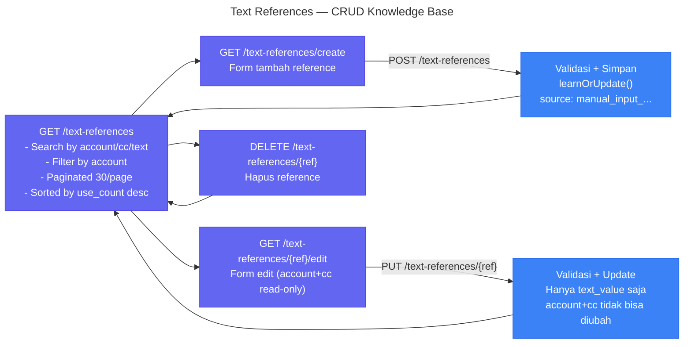

---

## 7. Reset Center — Administratif

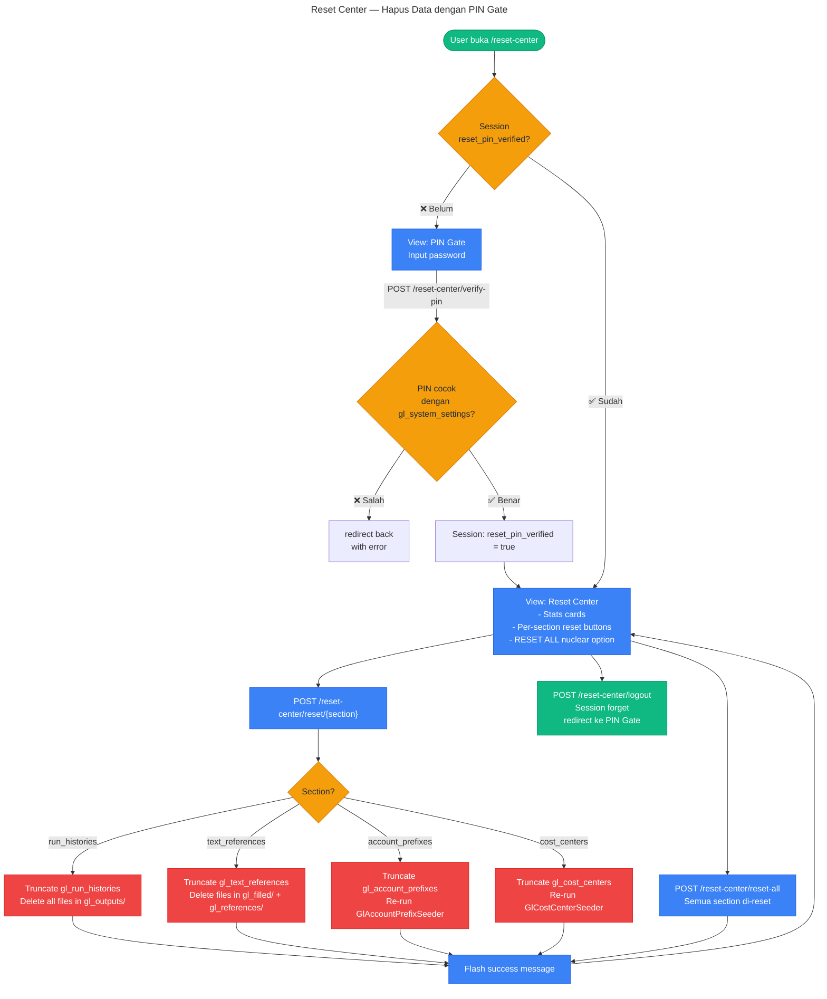

---

## 8. Data Model Relationships

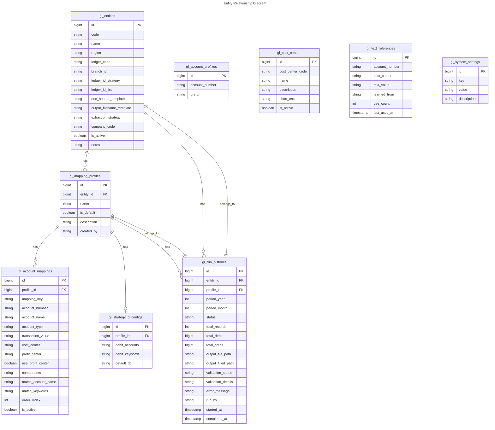

---

## 9. Extraction Strategy Decision Tree

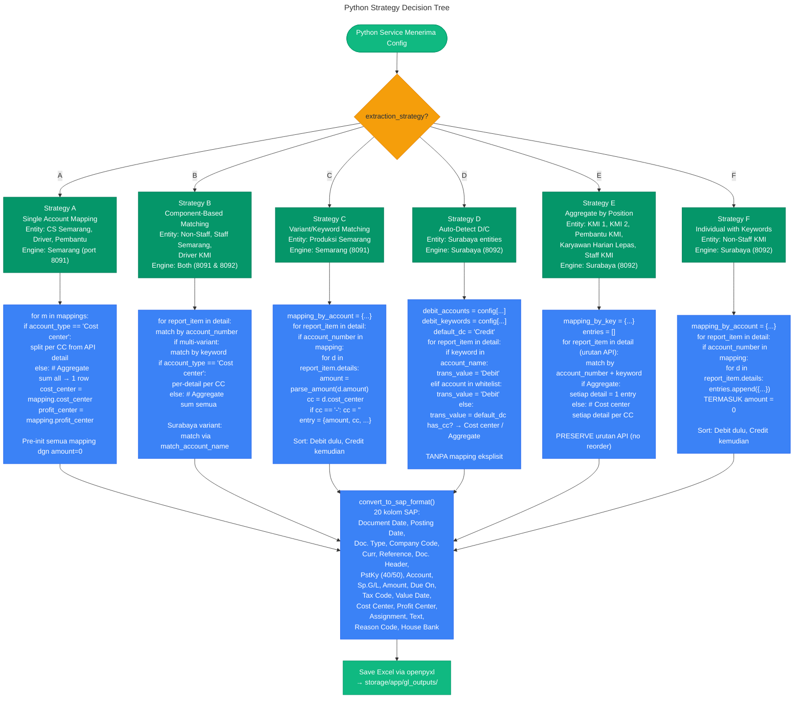

---

## 10. Complete User Journey Map

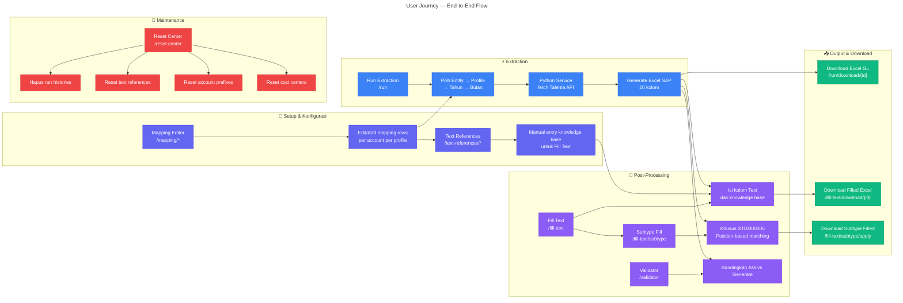

---

> **Dibuat:** 10 Juni 2026 — Berdasarkan analisis source code aktual.
